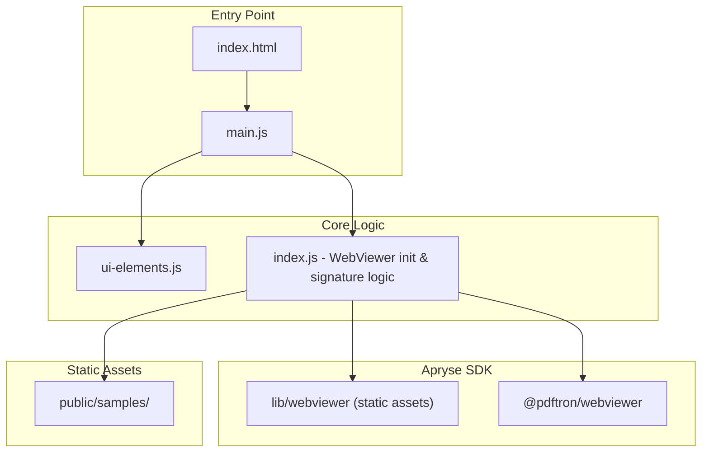

# Digital Signatures Showcase Demo

A runnable showcase demo for **multiple digital signatures** in Apryse WebViewer 11. This project highlights a **validation discrepancy**: signatures may appear valid in Apryse but show as invalid when the same PDF is downloaded and opened in Adobe Acrobat.

## Purpose

- Demonstrate **multiple signature** workflows in Apryse WebViewer
- Reproduce and document the **Apryse vs Adobe validation mismatch**
- Provide a minimal, Vercel-deployable demo for debugging and discussion

## Validation Discrepancy

| Viewer | Result |
|--------|--------|
| **Apryse WebViewer** | Signatures may show as valid ✓ |
| **Adobe Acrobat** (after download) | Same signatures may show as invalid ✗ |

Use this demo to reproduce the issue and compare behavior across viewers.

## How to Reproduce

1. Run the app and load a PDF (blank or with content)
2. Add one or more signature fields using the Signature tool
3. Draw a visual signature on each field
4. Click **Apply Approval Signature** and sign with your PFX certificate
5. Verify in Apryse (may show valid)
6. **Download** the signed PDF
7. Open the downloaded file in **Adobe Acrobat**
8. Check signature validation in Adobe (may show invalid)

## Application Architecture



## Features

- View PDF documents in WebViewer
- Add **unlimited** signature fields and sign them with your certificate
- **Certificate required** - no stored certificates; you must provide your own PFX and password
- **Document permissions** - first signer can set DocMDP rules (no changes, form filling, annotations, or unrestricted)
- **Add as trusted** - optional checkbox to add your certificate to the trusted list (green tick in Apryse)
- Validate digital signatures in the built-in signature panel
- Download digitally signed PDFs
- Custom Digital Signature panel with Fill & Sign tools

## File Structure

```
showcase-demo-digital-signatures/
├── .env.example
├── .gitignore
├── index.html
├── package.json
├── vercel.json
├── vite.config.js
├── public/
│   └── samples/
│       ├── signature-sample.pdf
│       └── README.md
└── src/
    ├── main.js          (entry, bootstraps WebViewer)
    ├── index.js         (WebViewer init + signature logic)
    ├── ui-elements.js   (custom panel UI)
    └── style.css
```

## Prerequisites

- Node.js 18 or higher

## Setup

1. **Install dependencies**

   ```bash
   npm install
   ```

2. **Certificate for signing** (required to sign)

   You must provide your own PFX certificate and password when signing. No certificates are stored by this application. Use the "Select Digital ID File" button in the panel to upload your `.pfx` file. To create a self-signed certificate, see the [Apryse blog on self-signed certificates](https://apryse.com/blog/webviewer/pdf-signing-with-self-signed-certificate).

3. **Set license key**

   Copy `.env.example` to `.env` and add your Apryse trial key:

   ```bash
   cp .env.example .env
   ```

   Edit `.env` and replace `YOUR_LICENSE_KEY` with your key from [https://dev.apryse.com](https://dev.apryse.com).

## Run

```bash
npm run dev
```

Open the localhost URL in your browser.

## Build

```bash
npm run build
```

## Deploy (Vercel)

1. Push to GitHub
2. Import the repo in Vercel
3. Add `VITE_LICENSE_KEY` in Vercel environment variables
4. Deploy (Vite is auto-detected via `vercel.json`)

## Tech Stack

- Vite + Vanilla JavaScript
- Apryse WebViewer 11
- Digital Signature package (Full API)
- node-forge (PFX parsing for trusted certificate extraction)
